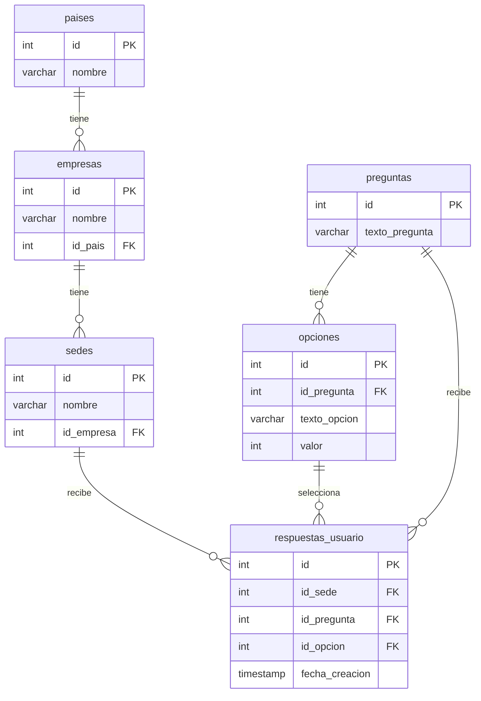

# Diagrama entidad-relacion

Notas:
- Cada pais puede tener varias empresas; cada empresa pertenece a un unico pais.
- Cada empresa puede tener varias sedes; cada sede pertenece a una unica empresa.
- Cada pregunta puede tener varias opciones de respuesta.
- Cada respuesta de usuario referencia una sede, una pregunta y la opcion elegida.