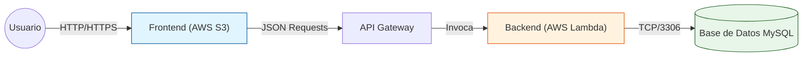

# Diagrama de la Arquitectura del sistema

```mermaid
graph LR
    User((Usuario)) -- HTTP/HTTPS --> S3["Frontend (AWS S3)"]
    S3 -- JSON Requests --> APIG["API Gateway"]
    APIG -- Invoca --> Lambda["Backend (AWS Lambda)"]
    Lambda -- TCP/3306 --> RDS[("Base de Datos MySQL")]
    
    style S3 fill:#E1F5FE,stroke:#01579B
    style Lambda fill:#FFF3E0,stroke:#E65100
    style RDS fill:#E8F5E9,stroke:#1B5E20
```